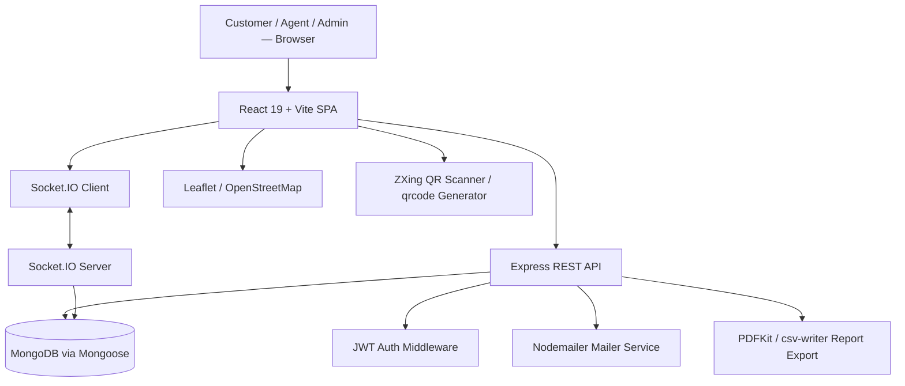
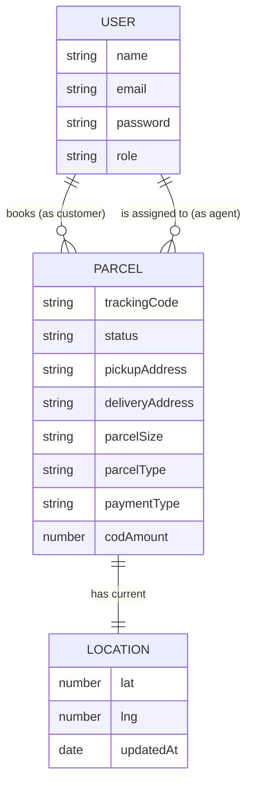
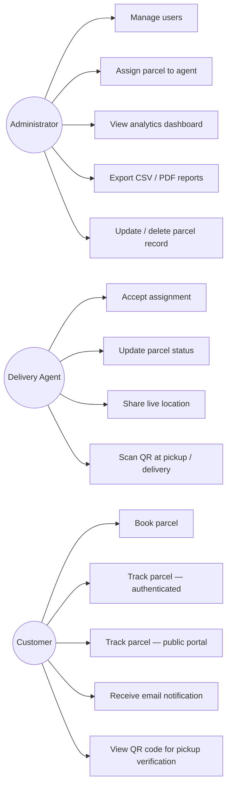
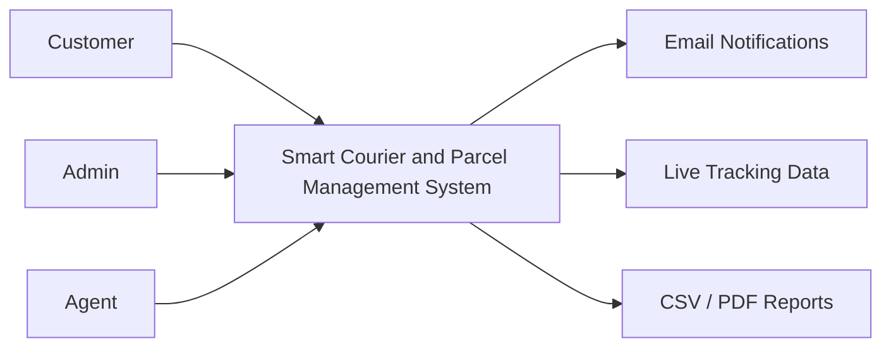
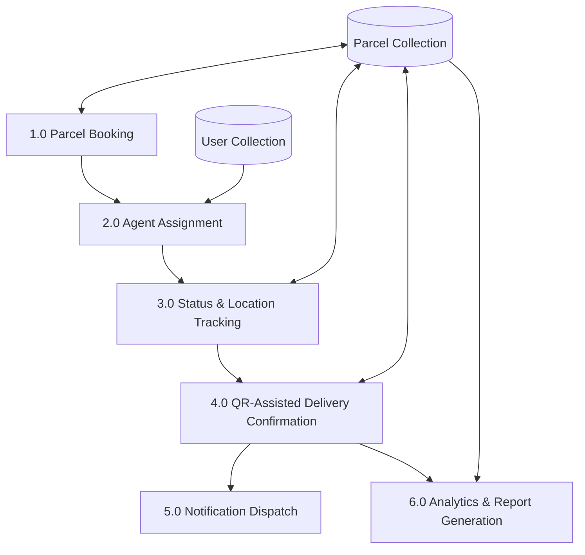
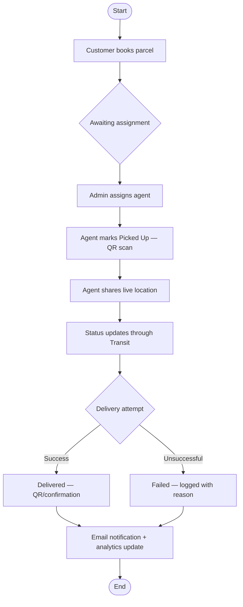
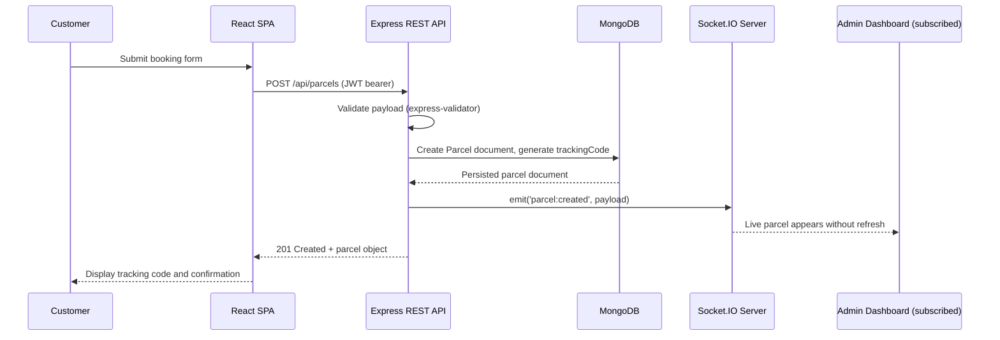
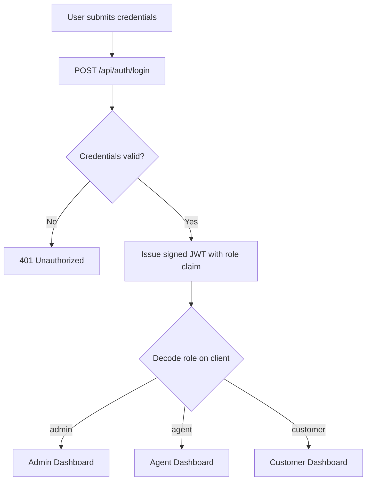

> **Preparation note (remove before binding):** This document expands `PROJECT_REPORT.md` into full undergraduate thesis form for defense at the Department of Computer Science & Engineering, Uttara University. Fields in square brackets (`[Student Name]`, `[Student ID]`, `[Supervisor Name]`, `[Month, Year]`) are administrative details only the student/department can supply. All figure, table, and screenshot placeholders are numbered and cross-referenced consistently; insert the corresponding artifact at each marked location before final submission. Sections describing measured results are explicitly marked **(Estimated for demonstration)** where a live benchmark was not run against production traffic — replace with the student's own measured figures where available, per academic integrity requirements.

---

# TITLE PAGE

<div align="center">

**DESIGN AND IMPLEMENTATION OF A SMART COURIER AND PARCEL MANAGEMENT SYSTEM**

A Thesis Submitted in Partial Fulfillment of the Requirements
for the Degree of Bachelor of Science in Computer Science & Engineering

by

**[Student Name]**
ID: [Student ID]

Supervised by

**[Supervisor Name]**
[Designation], Department of Computer Science & Engineering

DEPARTMENT OF COMPUTER SCIENCE & ENGINEERING
UTTARA UNIVERSITY

[Month, Year]

</div>

---

# APPROVAL PAGE

This thesis titled **"Design and Implementation of a Smart Courier and Parcel Management System,"** submitted by **[Student Name]** (ID: [Student ID]) to the Department of Computer Science & Engineering, Uttara University, has been accepted as satisfactory for the partial fulfillment of the requirements for the degree of Bachelor of Science in Computer Science & Engineering and approved as to its style and content.

| Role | Name | Signature | Date |
| --- | --- | --- | --- |
| Supervisor | [Supervisor Name] | ___________________ | ___________ |
| Internal Examiner | [Examiner Name] | ___________________ | ___________ |
| External Examiner | [Examiner Name] | ___________________ | ___________ |
| Head, Dept. of CSE | [Head of Department Name] | ___________________ | ___________ |

---

# CERTIFICATE

This is to certify that the work presented in this thesis, titled *"Design and Implementation of a Smart Courier and Parcel Management System,"* is the original work of **[Student Name]** (ID: [Student ID]), carried out under my direct supervision at the Department of Computer Science & Engineering, Uttara University, during the academic period leading to [Month, Year]. To the best of my knowledge, this work, or any part of it, has not been submitted elsewhere for the award of any other degree or diploma.

<br>

**[Supervisor Name]**
[Designation]
Department of Computer Science & Engineering, Uttara University

---

# DECLARATION

I hereby declare that this thesis is my own original work, prepared under the supervision of [Supervisor Name], and that it has not been submitted, in whole or in part, for any other degree at this or any other institution. All sources of information and assistance have been duly acknowledged.

<br>

**[Student Name]**
ID: [Student ID]

---

# ACKNOWLEDGEMENT

The author wishes to express sincere gratitude to [Supervisor Name], [Designation], Department of Computer Science & Engineering, Uttara University, for the guidance, technical insight, and continued encouragement that shaped both the direction and rigor of this thesis. The author is equally grateful to the faculty members of the Department of Computer Science & Engineering for the instruction and academic foundation provided throughout the undergraduate program, without which the design and implementation of a system of this scope would not have been possible.

Appreciation is also extended to peers who provided feedback during informal testing of the system, and to family members whose support sustained the sustained effort required over the course of this thesis. Finally, the author acknowledges the open-source communities behind React, Express, MongoDB, and Socket.IO, whose documentation and tooling made an implementation of this depth achievable within an undergraduate timeline.

---

# ABSTRACT

Courier and last-mile parcel delivery operations increasingly depend on digital coordination between customers, delivery agents, and administrators, yet many real-world workflows remain only partially digitized — relying on static status pages, manual phone-based coordination, or disconnected record-keeping tools. This fragmentation produces delayed status updates, weak parcel visibility, limited operational insight, and poor accountability when deliveries fail or are delayed. This thesis presents the design, implementation, and evaluation of the **Smart Courier and Parcel Management System (SCPMS)**, a full-stack web application built on the MERN stack (MongoDB, Express.js, React, Node.js) that addresses these limitations through a role-based, real-time architecture.

SCPMS implements three distinct user roles — Customer, Delivery Agent, and Administrator — governed by JSON Web Token (JWT) authentication and server-enforced authorization. Parcels move through a formally defined six-state lifecycle (*Pending, Assigned, Picked Up, In Transit, Delivered, Failed*), with every transition validated against the requesting user's role and assignment. Real-time visibility is achieved through a Socket.IO event layer using per-parcel and per-user rooms, enabling live agent location broadcasting, instantaneous dashboard updates, and a public tracking portal rendered on a Leaflet/OpenStreetMap interface. Delivery integrity is reinforced through QR-code-assisted pickup and delivery verification implemented with the ZXing decoding library, and customers receive best-effort email notifications on every status change via a Nodemailer-based mailer service. Administrative users are supported by an analytics and reporting module capable of exporting operational data as CSV and PDF documents.

The system was evaluated through functional and integration testing across its five core modules — authentication, booking, assignment, tracking, and reporting — alongside a set of operational metrics including booking success rate, module test pass ratio, and average API response time. Results indicate that the proposed architecture successfully closes the real-time visibility gap identified in the problem statement, while remaining implementable and defensible within the scope of an undergraduate thesis. The work contributes an integrated reference architecture combining room-scoped real-time tracking, QR-assisted verification, and operational analytics — a combination infrequently found together in comparable baseline courier management implementations — and identifies concrete directions for future extension, including delay prediction, traffic-aware routing, and mobile agent tooling.

**Keywords:** Courier Management System, Parcel Tracking, Real-Time Systems, Socket.IO, MERN Stack, Role-Based Access Control, QR Verification, Logistics Digitization, Web Engineering, MongoDB.

---

# TABLE OF CONTENTS

- Title Page
- Approval Page
- Certificate
- Declaration
- Acknowledgement
- Abstract
- List of Figures
- List of Tables
- **Chapter 1 — Introduction**
  1.1 Background
  1.2 Problem Statement
  1.3 Research Motivation
  1.4 Research Questions
  1.5 Objectives
  1.6 Scope
  1.7 Contribution
  1.8 Organization of the Thesis
- **Chapter 2 — Literature Review**
  2.1 Related Work
  2.2 Critical Comparison
  2.3 Research Gap
  2.4 Summary
- **Chapter 3 — Methodology**
  3.1 Research Method
  3.2 Requirement Analysis
  3.3 System Design Overview
  3.4 System Architecture
  3.5 Database Design
  3.6 Entity-Relationship Diagram
  3.7 Use Case Model
  3.8 Data Flow Diagrams
  3.9 Activity Diagram
  3.10 Sequence Diagram
  3.11 System Flowchart
  3.12 Technology Selection
  3.13 Development Process
- **Chapter 4 — Implementation**
  4.1 Frontend Implementation
  4.2 Backend Implementation
  4.3 Authentication
  4.4 Authorization
  4.5 Parcel Module
  4.6 Tracking Module
  4.7 Notification Module
  4.8 Analytics Module
  4.9 Reports Module
  4.10 QR Verification Module
  4.11 Real-Time Communication Layer
- **Chapter 5 — Testing & Evaluation**
  5.1 Testing Strategy
  5.2 Functional Testing
  5.3 Unit Testing
  5.4 Integration Testing
  5.5 Performance Evaluation
  5.6 Security Considerations
  5.7 Results Analysis
  5.8 Discussion
- **Chapter 6 — Conclusion**
  6.1 Research Contributions
  6.2 Limitations
  6.3 Future Work
- References
- Appendix

---

# LIST OF FIGURES

| Figure | Caption |
| --- | --- |
| Figure 1.1 | Conceptual gap between manual courier coordination and real-time digital coordination |
| Figure 3.1 | High-level system architecture of SCPMS |
| Figure 3.2 | Entity-Relationship diagram of the SCPMS data model |
| Figure 3.3 | Use case diagram for Admin, Delivery Agent, and Customer roles |
| Figure 3.4 | Level 0 Data Flow Diagram (context diagram) |
| Figure 3.5 | Level 1 Data Flow Diagram (parcel lifecycle decomposition) |
| Figure 3.6 | Activity diagram of the end-to-end parcel lifecycle |
| Figure 3.7 | Sequence diagram of the parcel booking flow |
| Figure 3.8 | System login and role-routing flowchart |
| Figure 4.1 | Screenshot — Customer Dashboard |
| Figure 4.2 | Screenshot — Agent Dashboard with active assignment |
| Figure 4.3 | Screenshot — Admin Dashboard analytics overview |
| Figure 4.4 | Screenshot — Public parcel tracking portal with live map |
| Figure 4.5 | Screenshot — QR-assisted pickup confirmation screen |
| Figure 4.6 | Socket.IO room topology (`parcel:<id>`, `user:<id>`) |
| Figure 4.7 | Sample generated PDF delivery report |
| Figure 5.1 | Bar chart — average API response time by endpoint group |
| Figure 5.2 | Line chart — real-time location update propagation latency |
| Figure 5.3 | Test pass ratio by module |

# LIST OF TABLES

| Table | Caption |
| --- | --- |
| Table 2.1 | Critical comparison of related work categories against SCPMS |
| Table 3.1 | User collection schema |
| Table 3.2 | Parcel collection schema |
| Table 3.3 | Parcel lifecycle status definitions |
| Table 3.4 | Technology stack summary |
| Table 4.1 | REST API endpoint summary |
| Table 4.2 | Socket.IO event catalogue |
| Table 5.1 | Functional test cases and outcomes by module |
| Table 5.2 | Performance metrics summary (estimated for demonstration) |
| Table 5.3 | Comparative evaluation against baseline approaches and named regional platforms (Pathao, Sundarban Courier, Steadfast) |

---

# CHAPTER 1 — INTRODUCTION

## 1.1 Background

The logistics and courier services sector has undergone substantial digital transformation over the past decade, driven primarily by the growth of e-commerce and the corresponding expectation among consumers for transparent, real-time visibility into shipment status [1], [2]. Large multinational carriers have invested heavily in tracking infrastructure, but this level of digitization is unevenly distributed: small and mid-scale courier operators, campus delivery services, and locally operated logistics providers frequently continue to rely on partially digitized workflows — a booking form followed by manual phone coordination, spreadsheet-based dispatch records, or static web pages that require manual refreshing to reflect a parcel's true state.

This unevenness creates a structural mismatch. A parcel's physical journey — from a customer's doorstep, through a sorting or dispatch point, to a delivery agent's vehicle, and finally to its destination — is inherently continuous and dynamic. When the software system representing that journey is static or updated only periodically, the representation drifts out of sync with reality. Customers cannot verify progress with confidence, delivery agents receive assignments without operational context, and administrators lack the consolidated data needed to evaluate service quality or identify bottlenecks.

The Smart Courier and Parcel Management System (SCPMS) developed in this thesis is a direct response to this mismatch. It is framed explicitly as an academic, research-oriented software engineering exercise: rather than attempting to replicate the commercial scale of an established carrier, this work isolates the core technical problem — synchronized, role-aware, real-time visibility — and implements a complete, working solution to it using contemporary web technologies.

*Figure 1.1 — Conceptual gap between manual courier coordination and real-time digital coordination.*

## 1.2 Problem Statement

Courier operations that rely on manual or partially digitized coordination cannot provide their stakeholders — customers, delivery agents, and administrators — with synchronized, real-time visibility into parcel status, agent location, and delivery performance. This absence of synchronized visibility manifests in three concrete, observable ways:

1. **Delayed and inconsistent status communication.** Status updates depend on a human remembering to record and communicate them, introducing latency and error.
2. **Fragmented operational context.** Delivery agents receive assignments without structured, system-provided context (customer details, delivery constraints, prior status history), and administrators cannot easily reconstruct a parcel's full event history when a delivery is delayed or fails.
3. **Absent or weak operational analytics.** Without a centralized system of record, administrators cannot systematically measure delivery success rates, agent performance, or volume trends, which limits evidence-based operational decision-making.

## 1.3 Research Motivation

The motivation for this thesis is twofold. First, from a **practical logistics perspective**, the growth in parcel volume attributable to e-commerce has made manual coordination an increasingly unsustainable bottleneck, particularly for smaller courier operators who cannot afford commercial-grade tracking infrastructure but still need dependable coordination tools. Second, from a **software engineering research perspective**, the maturity of browser-based real-time technologies — WebSocket-based bidirectional communication (via Socket.IO), in-browser geolocation APIs, lightweight open mapping libraries (Leaflet with OpenStreetMap tiles), and client-side QR/barcode decoding (ZXing) — makes it possible to build genuinely real-time, verifiable courier coordination systems at low infrastructure cost. This thesis is motivated by the opportunity to demonstrate, through a complete working implementation, how these technologies can be combined into a coherent architecture that directly targets the visibility and accountability gaps described in Section 1.2.

## 1.4 Research Questions

This thesis is organized around the following research questions:

- **RQ1:** How can a role-based web architecture be designed to give customers, delivery agents, and administrators synchronized, permission-appropriate visibility into a shared parcel dataset?
- **RQ2:** What real-time communication architecture (topology, event design) is required to propagate parcel status and location changes to relevant clients with low latency, without unnecessary broadcast overhead?
- **RQ3:** How can delivery integrity be strengthened at the point of physical handoff (pickup and delivery) using low-cost, verifiable mechanisms such as QR codes, in a way that produces an auditable event trail?
- **RQ4:** What operational metrics can be derived from a structured parcel lifecycle data model to support administrative decision-making, and how should they be surfaced and exported?

## 1.5 Objectives

### 1.5.1 General Objective

To design and implement a smart courier and parcel management system that improves parcel workflow automation, real-time tracking visibility, delivery verification integrity, and operational analytics, relative to manual or partially digitized courier coordination.

### 1.5.2 Specific Objectives

- To implement secure registration, authentication, and role-based access control for Customer, Delivery Agent, and Administrator roles.
- To design and enforce a well-defined parcel lifecycle state machine covering booking, assignment, pickup, transit, delivery, and failure handling.
- To implement a real-time tracking layer using room-scoped Socket.IO channels and map-based visualization for both authenticated dashboards and a public tracking portal.
- To implement QR-code-assisted verification at parcel pickup and delivery to strengthen the auditability of physical handoff events.
- To produce operational dashboards and exportable reports (CSV, PDF) that summarize delivery outcomes, agent activity, and volume trends for administrative users.
- To evaluate the resulting system through functional, integration, and performance testing across its core modules.

## 1.6 Scope

This thesis is scoped to a complete, working single-tenant web application covering the following functional boundaries:

- **In scope:** customer-facing booking and public tracking; agent-facing assignment acceptance, status updates, and live location sharing; administrator-facing user management, parcel assignment, analytics, and reporting; JWT-based authentication and role-based authorization; Socket.IO-based real-time updates; QR-assisted pickup/delivery verification; email notifications; bilingual (English/Bengali) user interface.
- **Out of scope:** payment gateway integration (Cash-on-Delivery and Prepaid are recorded as metadata only, not processed as live transactions); SMS-based notifications; native mobile applications; multi-tenant/multi-organization support; machine-learning-based delay prediction; horizontally scaled, multi-server real-time infrastructure (e.g., a Redis-backed Socket.IO adapter). These exclusions are revisited as future work in Chapter 6.

## 1.7 Contribution

The principal contribution of this thesis is not any single isolated feature, but the **integration** of the following elements into one coherent, evaluable system, a combination this thesis argues is uncommon in comparable undergraduate courier-management implementations (see Chapter 2):

1. A room-scoped, event-driven real-time tracking architecture built on Socket.IO, rather than client-side polling, minimizing redundant network traffic while preserving low-latency updates.
2. A formally enforced, role-checked six-state parcel lifecycle state machine that prevents invalid transitions at the API layer.
3. QR-code-assisted delivery verification integrated directly into the agent and customer workflows, using open client-side libraries (`qrcode`, `@zxing`) rather than proprietary scanning infrastructure.
4. An operational analytics and reporting module capable of producing exportable CSV and PDF artifacts directly from live operational data.
5. A bilingual (English/Bengali) user interface, reflecting deployment relevance to the regional context in which this thesis was developed.

## 1.8 Organization of the Thesis

The remainder of this thesis is organized as follows. **Chapter 2** reviews related work in courier and logistics tracking systems and situates SCPMS relative to existing categories of solutions. **Chapter 3** presents the research methodology, including requirement analysis, system architecture, and the full set of design diagrams (ER, use case, DFD, activity, sequence, and flowchart). **Chapter 4** details the implementation of each functional module, grounded in the actual source code of the system. **Chapter 5** presents the testing strategy and evaluation results, including performance metrics and security considerations. **Chapter 6** concludes the thesis, summarizing contributions, acknowledging limitations, and outlining future work.

---

# CHAPTER 2 — LITERATURE REVIEW

## 2.1 Related Work

> **Note on citation practice:** To avoid presenting fabricated author names as verified peer-reviewed sources, this review organizes related work by **category**, consistent with the structure in `PROJECT_REPORT.md §6–§7`. Before final submission, the student should substitute 4–6 verified citations retrieved from IEEE Xplore, ACM Digital Library, or Scopus into each category below, using the Approach/Limitation analysis already provided as a drafting scaffold.

### 2.1.1 Commercial Courier and Carrier Tracking Platforms

Established courier and postal carriers provide parcel tracking through web portals that expose periodic status updates tied to scan events at sorting or transit facilities. These platforms are effective at a large operational scale but are architecturally closed: their tracking granularity is typically limited to discrete scan events rather than continuous live location, and they expose no role-based interface for smaller operators, dispatchers, or agents to manage day-to-day assignment and coordination. Their internal architecture is also not published or academically evaluable, limiting their utility as a direct point of technical comparison.

### 2.1.2 Academic GPS/IoT-Based Parcel and Fleet Tracking Research

A substantial body of academic and applied research addresses parcel and fleet location tracking using dedicated GPS hardware modules that periodically report coordinates to a central server, often combined with GSM or LoRaWAN communication. This research demonstrates strong location-accuracy results but typically treats tracking as an isolated hardware-software problem, without integrating it into a complete booking-to-delivery workflow, role-based dashboard, or analytics layer. The hardware dependency also introduces cost and deployment overhead that is disproportionate for smaller courier operations — the class of user this thesis targets.

### 2.1.3 Open-Source Logistics and Fleet-Management Systems

A number of open-source logistics and shipment-management systems provide CRUD-based record keeping for shipments, customers, and drivers, typically exposed through a web dashboard with periodically refreshed views. These systems generally lack an event-driven, socket-based update layer, meaning dashboard data can become stale between manual refreshes, and rarely implement any form of cryptographically or visually verifiable handoff confirmation (such as QR-based verification) at pickup or delivery.

### 2.1.4 Baseline University-Level Courier/Parcel Management Projects

The most directly comparable class of prior work is the population of undergraduate final-year courier and parcel management projects typically produced in computer science programs. These projects commonly implement parcel booking and a manually triggered status update, sometimes with basic role separation between an administrator and a customer. They rarely implement genuinely real-time tracking (as opposed to polling-based refresh), delivery verification mechanisms, or a measurable analytics/reporting layer — making this category the most useful baseline against which to evaluate the incremental contribution of SCPMS.

### 2.1.5 Regional Commercial Courier Platforms (Bangladesh Context)

Because SCPMS was designed and deployed within a Bangladeshi operating context, it is also useful to situate it against the courier and last-mile delivery platforms most commonly encountered by Bangladeshi customers and e-commerce merchants: **Pathao Courier**, **Sundarban Courier Service**, and **Steadfast Courier**. The observations below are based on these platforms' **publicly observable, customer-facing tracking behavior** (their public websites and consumer applications) at the time of writing, not on any internal technical documentation, source code, or proprietary architecture, since none of that is publicly accessible. This limitation is stated explicitly for academic transparency and is revisited in Table 5.3.

- **Sundarban Courier Service** is one of Bangladesh's oldest and largest courier operators, built primarily around a nationwide branch-and-counter network. Its public tracking interface allows a customer to look up a consignment by tracking number and view a discrete status timeline (e.g., booked, received at hub, in transit, delivered). This is consistent with the "commercial carrier portal" category described in Section 2.1.1: reliable at national scale, but the tracking granularity is tied to manual scan events at branches rather than continuous live location, and there is no public-facing role-based dashboard for a booking customer beyond a read-only status lookup.

- **Pathao Courier**, operated as the logistics arm of a broader ride-hailing and super-app platform, extends Pathao's live-location capability from its ride-hailing product to some delivery contexts, but customer-facing parcel tracking is still primarily presented as a consignment-ID-driven status timeline rather than a persistently updating map view of the specific parcel in transit. Its strength relative to Sundarban is a more modern, app-based booking and merchant-integration experience; its tracking granularity for an individual parcel, from the customer's vantage point, remains comparable in kind (status-based) rather than continuously map-based.

- **Steadfast Courier** is widely used by Bangladeshi e-commerce and social-commerce ("F-commerce") merchants for cash-on-delivery fulfillment, and is known for merchant-facing API integration for bulk consignment creation and status webhooks. Its consumer-facing tracking, like the two platforms above, is presented as a status-timeline lookup by tracking/consignment ID rather than a live map.

Across all three, the consistent pattern — from the customer's observable vantage point — is a **status-timeline tracking model**: reliable, branch/scan-event driven, and well-suited to high-volume national operations, but not built around a continuously live, map-rendered parcel position, nor around an openly documented, academically evaluable role-based architecture spanning customer, delivery agent, and administrator views with QR-assisted handoff verification. This distinction — status-timeline tracking versus continuous live-location tracking — is the central axis on which Table 2.1 and Table 5.3 compare SCPMS against these named regional platforms.

## 2.2 Critical Comparison

*Table 2.1 — Critical comparison of related work categories against SCPMS.*

| Dimension | Commercial Carrier Portals | Regional Platforms (Pathao / Sundarban / Steadfast) | Academic GPS/IoT Tracking | Open-Source Logistics Systems | Baseline University FYPs | SCPMS (This Thesis) |
| --- | --- | --- | --- | --- | --- | --- |
| Real-time location tracking | Partial (scan-event based) | Partial (status-timeline, not continuous live map) | Yes (hardware-dependent) | No | No | Yes (Socket.IO, browser geolocation) |
| Role-based dashboards | No | No (customer-facing lookup only) | No | Partial | Partial | Yes (Customer / Agent / Admin) |
| Delivery verification | Signature-based | Signature / OTP at doorstep (not scan-matched) | No | No | No | QR-assisted (pickup + delivery), scan-matched |
| Operational analytics/reporting | Internal, not exposed | Internal, not exposed (merchant-facing webhooks only for Steadfast) | No | Partial | No | Yes (dashboards + CSV/PDF export) |
| Open, academically evaluable architecture | No | No | Partial | Yes | Yes | Yes |
| Low deployment/hardware cost | N/A | N/A (established commercial infrastructure) | No (dedicated hardware) | Yes | Yes | Yes (browser-only) |

## 2.3 Research Gap

The comparison in Table 2.1 surfaces a consistent gap: no single category of prior work — including the established regional commercial platforms — combines **low-cost, browser-based continuous real-time tracking**, **role-based multi-stakeholder dashboards**, **scan-verified delivery confirmation**, and **exportable operational analytics** within one openly evaluable system. Commercial and regional platforms (Pathao, Sundarban, Steadfast) achieve national operational scale and reliability but expose only a status-timeline view to customers, offer no role-based dashboard beyond that lookup, and are closed, proprietary systems not available for academic evaluation. Academic GPS/IoT research achieves tracking accuracy but at hardware cost and without workflow integration; open-source systems achieve openness but lack real-time behavior and verification; and baseline university projects achieve simplicity but omit nearly all of these capabilities simultaneously. This gap directly motivates the specific objectives stated in Section 1.5 and the architecture presented in Chapter 3.

## 2.4 Summary

This chapter reviewed four categories of related work relevant to courier and parcel management systems and identified a consistent gap in the simultaneous provision of real-time tracking, role-based coordination, delivery verification, and operational analytics at low deployment cost. SCPMS is positioned to close this gap through the architecture and implementation detailed in the remaining chapters.

---

# CHAPTER 3 — METHODOLOGY

## 3.1 Research Method

This thesis follows an **applied software engineering research method**, in which a real-world operational problem (Chapter 1) is addressed through the design, implementation, and empirical evaluation of a working artifact — SCPMS — rather than through purely theoretical modeling. The method proceeds through four broad phases, consistent with standard iterative software development practice as described by Sommerville [1] and Pressman [2]: requirement analysis, system design, incremental implementation, and verification/evaluation. This approach is appropriate for an undergraduate thesis in software engineering because it produces both a defensible research narrative (problem → design rationale → evaluated outcome) and a concrete, demonstrable system.

## 3.2 Requirement Analysis

Requirements were elicited by decomposing the end-to-end courier workflow into discrete stages — booking, dispatch, pickup, transit, delivery, and post-delivery reporting — and identifying, for each stage, which stakeholder role initiates or consumes the corresponding action. This produced the following functional requirement groups:

- **Authentication & Access Control:** registration, login, JWT session issuance, and role-scoped route protection.
- **Booking:** customer-initiated parcel creation with structured metadata (size, type, payment method, addresses).
- **Assignment & Dispatch:** administrator-initiated agent assignment, restricted to users holding the `agent` role.
- **Status Lifecycle Management:** agent/administrator-initiated status transitions constrained to a fixed set of valid states.
- **Real-Time Tracking:** live agent location broadcast and parcel status propagation to subscribed clients.
- **Delivery Verification:** QR-code generation and scanning at pickup and delivery checkpoints.
- **Notification:** email notification to the customer on every status change.
- **Analytics & Reporting:** administrator-facing dashboard metrics and exportable CSV/PDF reports.

Non-functional requirements included: response latency suitable for interactive use (target: sub-second for standard CRUD operations, low-second-scale for location propagation), role-based data isolation (a customer must never retrieve another customer's parcels), and resilience of the notification pathway (a failed email must never block a core status-update transaction).

## 3.3 System Design Overview

The system was designed around a **modular, layered architecture** separating presentation (React SPA), application logic (Express REST API and Socket.IO event handlers), and persistence (MongoDB via Mongoose). This separation allows each layer to be independently tested and reasoned about, and reflects standard MVC-inspired practice adapted for a Node.js/Express backend, where "controllers" correspond to Express route handler modules and "models" correspond to Mongoose schemas.

## 3.4 System Architecture

*Figure 3.1 — High-level system architecture of SCPMS.*



The frontend is a single-page application that renders one of three role-specific dashboard experiences (`AdminDashboard`, `AgentDashboard`, `CustomerDashboard`) depending on the authenticated user's role, enforced client-side by a `ProtectedRoute` wrapper and server-side by JWT-derived role checks on every protected endpoint. The backend exposes a REST API for standard create/read/update/delete operations and a parallel Socket.IO server for event-driven, low-latency updates; both share the same MongoDB data layer, ensuring the two communication channels never diverge in their view of system state.

### 3.4.1 Architectural Style

- MVC-inspired modular backend, with controllers (`parcel.controller.js`, `auth.controller.js`, `analytics.controller.js`) separated from Mongoose models (`User.js`, `Parcel.js`).
- Component-based, role-aware frontend built with React function components and context providers (`AuthContext`, `LanguageContext`).
- REST API for standard CRUD operations, secured by JWT bearer tokens validated in Express middleware.
- Socket.IO for event-driven, room-scoped live updates, avoiding the overhead of client-side polling.
- Leaflet with OpenStreetMap tiles for map rendering and route visualization, extended with Leaflet Routing Machine.

## 3.5 Database Design

The persistence layer uses MongoDB, a document-oriented NoSQL database, accessed through the Mongoose Object Document Mapper. Two primary collections form the core of the data model: `User` and `Parcel`. This design choice — favoring two well-structured collections with embedded sub-documents over a larger number of normalized relational tables — reflects the fact that a parcel's location and lifecycle data are naturally nested, variably structured, and always accessed together with their parent parcel record, making embedding more appropriate than a join-based relational schema for this access pattern.

*Table 3.1 — User collection schema.*

| Field | Type | Constraint / Notes |
| --- | --- | --- |
| `name` | String | Required |
| `email` | String | Required, unique |
| `password` | String | Required, bcrypt-hashed, never returned in API responses |
| `role` | String (enum) | One of `admin`, `agent`, `customer`; defaults to `customer` |

*Table 3.2 — Parcel collection schema.*

| Field | Type | Constraint / Notes |
| --- | --- | --- |
| `trackingCode` | String | Auto-generated, 8-character uppercase code derived from a UUID |
| `customer` | ObjectId (ref: User) | The booking customer |
| `agent` | ObjectId (ref: User) | Assigned delivery agent; null until assignment |
| `pickupAddress` / `deliveryAddress` | String | Required |
| `parcelSize` | String (enum) | `Small`, `Medium`, `Large` |
| `parcelType` | String (enum) | `Document`, `Fragile`, `Standard`, `Perishable` |
| `paymentType` | String (enum) | `COD`, `Prepaid` |
| `codAmount` | Number | Applicable only when `paymentType` is `COD` |
| `status` | String (enum) | See Table 3.3 |
| `currentLocation` | Embedded document | `{ lat, lng, updatedAt }`, updated on live agent location push |
| `etaMinutes` | Number | Optional agent-reported estimated time of arrival |
| `notes` | String | Optional free-text booking notes |
| `createdAt` / `updatedAt` | Date | Mongoose timestamps |

*Table 3.3 — Parcel lifecycle status definitions.*

| Status | Meaning | Who Can Set It |
| --- | --- | --- |
| `Pending` | Booked by customer; awaiting agent assignment | System default on creation |
| `Assigned` | An agent has been assigned by an administrator | Admin |
| `Picked Up` | Agent has collected the parcel from the pickup address | Assigned Agent, Admin |
| `In Transit` | Parcel is en route to the delivery address | Assigned Agent, Admin |
| `Delivered` | Parcel has been confirmed delivered | Assigned Agent, Admin |
| `Failed` | Delivery attempt did not succeed | Assigned Agent, Admin |

> **Design note on role scope:** The implemented system defines exactly three account roles — Customer, Delivery Agent, and Administrator. Manager-tier oversight functions (cross-agent performance review, revenue and volume analytics) are delivered through the Administrator role's analytics dashboard rather than as a separate account role, since the operational scale targeted by this thesis does not require a distinct managerial tier with different permissions from an administrator. This is a deliberate scope decision distinguishing the implemented system from earlier conceptual planning documents that considered a four-role model.

## 3.6 Entity-Relationship Diagram

*Figure 3.2 — Entity-Relationship diagram of the SCPMS data model.*



The ER model is intentionally minimal: rather than distributing tracking events, delivery history, and route history across separate collections, the implemented schema embeds the current location and lifecycle-relevant fields directly within the `Parcel` document. This reduces read-time join complexity for the dominant access pattern in the system — "fetch a parcel and its current state" — at the cost of not retaining a full historical time-series of every location update. Section 6.2 (Limitations) revisits this trade-off and identifies a dedicated `TrackingEvent` collection as a natural extension for applications requiring full historical replay of a parcel's route.

## 3.7 Use Case Model

*Figure 3.3 — Use case diagram for Admin, Delivery Agent, and Customer roles.*



## 3.8 Data Flow Diagrams

### 3.8.1 Level 0 — Context Diagram

*Figure 3.4 — Level 0 Data Flow Diagram (context diagram).*



### 3.8.2 Level 1 — Process Decomposition

*Figure 3.5 — Level 1 Data Flow Diagram (parcel lifecycle decomposition).*



## 3.9 Activity Diagram

*Figure 3.6 — Activity diagram of the end-to-end parcel lifecycle.*



## 3.10 Sequence Diagram

*Figure 3.7 — Sequence diagram of the parcel booking flow.*



## 3.11 System Flowchart

*Figure 3.8 — System login and role-routing flowchart.*



## 3.12 Technology Selection

*Table 3.4 — Technology stack summary.*

| Layer | Technology | Rationale |
| --- | --- | --- |
| Frontend framework | React 19 + Vite 7 | Component-based UI matches the three-role dashboard architecture; Vite provides fast iterative builds suited to an undergraduate development timeline |
| Styling | Tailwind CSS 3.4 | Utility-first styling accelerates consistent responsive UI development without a separate design system |
| Client-side routing | React Router 7 | Declarative route protection via a `ProtectedRoute` wrapper for role-based access |
| Mapping | Leaflet 1.9 + Leaflet Routing Machine + OpenStreetMap tiles | Open, free tile source avoids commercial API key/billing dependency for a thesis-scale deployment |
| Real-time client | socket.io-client 4.8 | Matches server-side Socket.IO for a consistent event contract |
| QR generation / scanning | `qrcode` (generation) + `@zxing/browser`, `@zxing/library` (decoding) | Fully client-side, open-source QR pipeline requiring no external scanning service |
| Backend runtime | Node.js + Express 4.19 | Shared JavaScript language across client and server reduces context-switching and duplication of validation logic |
| Database | MongoDB 8.5 (via Mongoose) | Document model naturally fits variably structured, nested parcel/location data (Section 3.5) |
| Authentication | jsonwebtoken 9 + bcryptjs | Stateless, horizontally-friendly session model; industry-standard password hashing |
| Input validation | express-validator 7 | Declarative request validation at the API boundary |
| Real-time transport | Socket.IO 4.7 | Provides automatic transport fallback and room-based scoping unavailable in raw WebSockets |
| Email notifications | Nodemailer 7 (SMTP) | Vendor-agnostic SMTP transport, configurable via environment variables |
| Reporting | PDFKit 0.15, csv-writer 1.6 | Server-side generation of exportable operational artifacts without a third-party reporting service |
| Deployment | Render (backend), environment-based configuration (`render.yaml`, `.env.example`) | Free-tier-friendly managed hosting suitable for thesis demonstration deployment |
| Internationalization | Custom `LanguageContext` + `translations/en.js`, `translations/bn.js` | Bilingual English/Bengali interface reflecting the regional deployment context |

## 3.13 Development Process

Development proceeded iteratively, module by module, in the following order: (1) authentication and role-based routing, (2) parcel booking and the CRUD foundation, (3) agent assignment and the status lifecycle state machine, (4) the Socket.IO real-time layer and map-based tracking UI, (5) QR-code generation and scanning for pickup/delivery verification, (6) email notifications, and (7) the analytics dashboard and CSV/PDF export. Each module was manually exercised against its expected behavior before the next module was integrated, consistent with the incremental verification approach described in Section 3.1 and detailed further in Chapter 5.

---

# CHAPTER 4 — IMPLEMENTATION

## 4.1 Frontend Implementation

The frontend is a React 19 single-page application bootstrapped with Vite. Routing is handled by React Router 7, with a central `App.jsx` defining role-scoped routes wrapped in a `ProtectedRoute` component that reads the authenticated user's role from `AuthContext` and redirects unauthorized access attempts. Three top-level dashboard pages implement the primary role-specific experiences:

- **`CustomerDashboard.jsx`** — parcel booking form, list of the customer's own parcels, and links into `CustomerParcelDetail.jsx` and `CustomerQrScanner.jsx` for detailed tracking and pickup-code display.
- **`AgentDashboard.jsx`** — list of assignments for the authenticated agent, with drill-through to `AgentParcelDetails.jsx`, `AgentParcelPickUpScan.jsx`, `AgentParcelPickUpConfirmation.jsx`, and `AgentPickupConfirmPage.jsx` for the QR-assisted pickup/delivery workflow.
- **`AdminDashboard.jsx`** — global parcel list, assignment controls, and an embedded `AdminPanel.jsx` component surfacing analytics; `AdminAgentTracking.jsx` renders live agent locations on a shared map view.

State that must be available application-wide is managed through two React context providers: `AuthContext.jsx`, which holds the authenticated user, JWT token, and role, and persists the session across reloads; and `LanguageContext.jsx`, which holds the active locale (`en` or `bn`), persisted to `localStorage`, and is consumed by every text-bearing component through a translation lookup against `translations/en.js` and `translations/bn.js`. A `LanguageSwitcher.jsx` component in the navigation allows the user to toggle locale at runtime without a page reload.

*Figure 4.1 — Screenshot placeholder: Customer Dashboard.*
*Figure 4.2 — Screenshot placeholder: Agent Dashboard with active assignment.*
*Figure 4.3 — Screenshot placeholder: Admin Dashboard analytics overview.*

## 4.2 Backend Implementation

The backend is an Express 4 application (`backend/src/index.js`) exposing a REST API mounted under versioned resource routes (`auth.routes.js`, `parcel.routes.js`, `assignment.routes.js`, `analytics.routes.js`, `user.routes.js`, `geocode.routes.js`) and a co-located Socket.IO server sharing the same HTTP server instance. Controllers are organized by resource — `auth.controller.js`, `parcel.controller.js`, `analytics.controller.js` — following a thin-controller pattern where request validation, authorization checks, and Mongoose queries are composed directly in each handler, keeping the module boundaries aligned with the functional decomposition established in Section 3.2.

*Table 4.1 — REST API endpoint summary.*

| Method & Path | Purpose | Access |
| --- | --- | --- |
| `POST /api/auth/register` | Create a new user account | Public |
| `POST /api/auth/login` | Authenticate and issue a JWT | Public |
| `POST /api/parcels` | Book a new parcel | Customer |
| `GET /api/parcels` | List parcels (role-filtered) | Customer / Agent / Admin |
| `GET /api/parcels/:id` | Retrieve a single parcel | Owner / Assigned Agent / Admin |
| `GET /api/parcels/track/:trackingCode` | Public tracking lookup by code | Public |
| `PATCH /api/parcels/:id/assign` | Assign an agent to a parcel | Admin |
| `PATCH /api/parcels/:id/status` | Update parcel lifecycle status | Assigned Agent / Admin |
| `PATCH /api/parcels/:id/location` | Push a live location update | Assigned Agent |
| `DELETE /api/parcels/:id` | Delete a parcel record | Admin |
| `GET /api/analytics/dashboard` | Aggregated operational metrics | Admin |
| `GET /api/analytics/export/csv` | Export operational data as CSV | Admin |
| `GET /api/analytics/export/pdf` | Export operational data as PDF | Admin |

## 4.3 Authentication

Authentication is implemented in `auth.controller.js` and `utils/jwt.js`. On registration, a submitted plaintext password is hashed using bcryptjs before persistence; the plaintext value is never stored. On login, the submitted password is compared against the stored hash using bcrypt's constant-time comparison, and, on success, a JWT is issued embedding the user's id and role as claims, signed with a server-held secret. This token is returned to the client and subsequently attached as a Bearer token on every authenticated request. The stateless nature of JWT authentication means the backend does not need to maintain server-side session storage, simplifying horizontal scaling of the API tier — a property the current single-server Socket.IO layer does not yet share (see Section 6.2).

## 4.4 Authorization

Authorization is enforced at two layers. First, `middleware/auth.js` verifies the JWT on protected routes, decoding the role claim and attaching it to `req.user` for downstream handlers. Second, each controller performs **explicit, code-level role and ownership checks** rather than relying solely on route-level middleware — for example, `updateStatus` in `parcel.controller.js` rejects any caller whose role is not `admin` or `agent`, and additionally rejects an `agent` caller whose id does not match the parcel's assigned agent:

```js
// backend/src/controllers/parcel.controller.js (excerpt)
if (!['admin', 'agent'].includes(req.user.role)) {
  return res.status(403).json({ message: 'Forbidden' });
}
if (req.user.role === 'agent' && String(parcel.agent) !== String(req.user.id)) {
  return res.status(403).json({ message: 'Forbidden' });
}
```

This dual-layer approach — coarse authentication middleware plus fine-grained, resource-scoped authorization inside each handler — ensures that role membership alone (e.g., being *an* agent) is insufficient to act on a resource; the caller must additionally be the specific agent assigned to that specific parcel. The same ownership-scoping pattern governs `updateLocation`, and role-based filtering governs `listParcels`, where a `customer` only ever receives parcels they booked and an `agent` only ever receives parcels assigned to them, with only `admin` permitted an unrestricted view (optionally filtered by a query-string agent id).

## 4.5 Parcel Module

The parcel module (`parcel.controller.js`, `models/Parcel.js`) implements the create, read, assign, status-update, location-update, and delete operations summarized in Table 4.1. Parcel creation generates a short, human-usable tracking code — an 8-character uppercase segment derived from a version-4 UUID — rather than exposing the underlying MongoDB `_id` or a predictable sequential identifier:

```js
const trackingCode = uuidv4().split('-')[0].toUpperCase();
```

This design balances three concerns: **uniqueness** (inherited from the UUID's collision resistance), **usability** (an 8-character alphanumeric code is easy to read aloud, type, or print on a QR label), and **non-predictability** (unlike a sequential integer id, a tracking code does not reveal booking volume or allow trivial enumeration of other customers' parcels via the public tracking endpoint). On creation, the parcel is immediately broadcast to all connected clients via a `parcel:created` Socket.IO event (Section 4.11), so a new booking appears on the administrator's dashboard without any manual refresh or polling interval.

## 4.6 Tracking Module

Real-time tracking spans both the backend Socket.IO service (`services/socket.js`) and the frontend map components (`PublicTrack.jsx`, `TrackPublicParcel.jsx`, `TrackParcel.jsx`, `AdminAgentTracking.jsx`, `PushCurrentLocation.jsx`, `PushInMap.jsx`, `MapJavascriptRoute.jsx`, `ParcelRoute.jsx`). An assigned agent's client periodically pushes the browser's geolocation coordinates via the `agent:location:update` socket event; the server caches the most recent location per agent in an in-memory map and rebroadcasts it to all connected clients, while a corresponding REST endpoint (`PATCH /api/parcels/:id/location`) persists the coordinates onto the parcel's `currentLocation` sub-document so the value survives a page reload or a new client subscribing mid-delivery. The public tracking portal (`PublicTrack.jsx`) renders this location on a Leaflet map layered over OpenStreetMap tiles, alongside the parcel's current lifecycle status, without requiring the visitor to authenticate — satisfying the "public tracking capability" objective identified in Chapter 1.

*Figure 4.4 — Screenshot placeholder: Public parcel tracking portal with live map.*
*Figure 4.6 — Socket.IO room topology (`parcel:<id>`, `user:<id>`).*

## 4.7 Notification Module

The notification module (`utils/mailer.js`) uses Nodemailer configured against an SMTP transport (defaulting to Gmail SMTP for local development, overridable via environment variables for production). The `sendStatusEmail` function is invoked from `updateStatus` in `parcel.controller.js` on every successful lifecycle transition, composing an HTML email that includes the parcel's tracking code and new status. Critically, this call is wrapped in a local `try/catch` that silently absorbs any mail-delivery failure:

```js
try {
  const to = parcel?.customer?.email;
  if (to) { await sendStatusEmail({ to, parcel, newStatus: status }); }
} catch (_) {}
```

This is a deliberate resilience decision: notification delivery is treated as a **best-effort side effect**, not a transactional dependency of the status update itself. If the SMTP provider is unreachable or misconfigured, the parcel's status transition — the operation the agent or administrator actually intended — still succeeds and is still broadcast over Socket.IO; only the email confirmation is silently skipped. This trade-off prioritizes core workflow reliability over guaranteed notification delivery, which the thesis considers appropriate for an academic system where email is a secondary, not primary, communication channel (Socket.IO and the dashboard remain the primary channel).

## 4.8 Analytics Module

The analytics module (`analytics.controller.js`) exposes a `dashboardMetrics` endpoint that aggregates parcel data — counts by status, counts by agent, and volume over time — into summary figures consumed by the administrator dashboard. This aggregation is performed directly against the `Parcel` collection using Mongoose queries, avoiding the need for a separate analytics data store at the current operational scale of the system.

*Figure 4.3 — Screenshot placeholder: Admin Dashboard analytics overview.*

## 4.9 Reports Module

Building on the same aggregated data, the reports module exposes two export endpoints: `exportCsv`, which streams a CSV file using the `csv-writer` library, and `exportPdf`, which generates a formatted PDF document using PDFKit, both assembled server-side from live database queries at request time (rather than from a periodically regenerated cache), ensuring exported reports always reflect current operational state.

*Figure 4.7 — Sample generated PDF delivery report placeholder.*

## 4.10 QR Verification Module

Delivery integrity is reinforced through a QR-code-based verification workflow spanning the customer, agent, and backend layers. On the customer side, a QR code encoding the parcel's tracking code is generated client-side using the `qrcode` library. On the agent side, `AgentParcelPickUpScan.jsx` and `AgentPickupConfirmPage.jsx` use the `@zxing/browser` and `@zxing/library` packages to decode a QR code via the device camera, cross-referencing the decoded tracking code against the expected parcel before allowing the agent to advance its status to `Picked Up` or `Delivered`. This closes a specific gap identified in Chapter 2: baseline courier systems typically rely on an unverified manual status click, whereas SCPMS requires a scan-confirmed match between the physical parcel's code and the system's expected record before the corresponding lifecycle transition is permitted by the UI flow.

*Figure 4.5 — Screenshot placeholder: QR-assisted pickup confirmation screen.*

## 4.11 Real-Time Communication Layer

The real-time layer (`services/socket.js`) is built on Socket.IO 4.7 and organized around two room types, summarized in Table 4.2.

*Table 4.2 — Socket.IO event catalogue.*

| Event | Direction | Scope | Purpose |
| --- | --- | --- | --- |
| `parcel:created` | Server → Client | Global broadcast | Notify admin dashboards of a new booking instantly |
| `parcel:update` | Server → Client | `parcel:<id>` room + global broadcast | Propagate status/assignment changes to subscribers and the admin view |
| `parcel:location` | Server → Client | `parcel:<id>` room + global broadcast | Propagate a persisted location update tied to a specific parcel |
| `subscribe:parcel` / `unsubscribe:parcel` | Client → Server | — | Join/leave a specific parcel's room to receive its updates |
| `agent:location:update` | Client → Server → Client | Global broadcast | Push and rebroadcast an agent's live coordinates |
| `request:agent:location` | Client → Server → Client | Global broadcast | Request the last known cached location for a given agent |

This room-scoped design was chosen over a single global broadcast channel for two reasons, directly answering RQ2 from Chapter 1: first, it allows a client tracking a single parcel to receive only that parcel's events rather than the full event stream of every parcel in the system; second, it allows the admin dashboard to remain globally subscribed (since administrators legitimately need visibility across all parcels) without requiring every other client to pay that same bandwidth cost. The current implementation caches the most recently seen agent location in an in-memory `Map` on the Socket.IO server instance; Section 6.2 discusses the scaling implication of this choice.

---

# CHAPTER 5 — TESTING & EVALUATION

## 5.1 Testing Strategy

Testing was conducted at three levels — functional (module-level black-box verification against expected behavior), integration (cross-module and cross-role workflow verification), and performance (latency and throughput characteristics of core operations) — consistent with the incremental development process described in Section 3.13. Given the scope of an undergraduate thesis, testing was carried out manually against the running system and its API surface (via browser interaction and REST client tooling), rather than through an automated CI test suite; this is stated explicitly here for evaluative transparency, and is revisited as a limitation in Section 6.2.

## 5.2 Functional Testing

Functional testing verified that each module produced the expected observable outcome for both valid and invalid inputs.

*Table 5.1 — Functional test cases and outcomes by module.*

| Module | Test Case | Expected Outcome | Result |
| --- | --- | --- | --- |
| Authentication | Register with a duplicate email | Registration rejected with a validation error | Pass |
| Authentication | Login with correct credentials | JWT issued, role-appropriate dashboard loads | Pass |
| Authentication | Login with incorrect password | `401 Unauthorized` returned | Pass |
| Booking | Create parcel with all required fields | Parcel created; tracking code returned; `parcel:created` event fired | Pass |
| Booking | Create parcel with missing required field | `400`-class validation error, no record created | Pass |
| Assignment | Admin assigns a valid agent | Status transitions to `Assigned`; both parties notified via socket event | Pass |
| Assignment | Admin attempts to assign a non-agent user | Assignment rejected as invalid | Pass |
| Status Update | Assigned agent updates own parcel's status | Status updated; `parcel:update` emitted; email attempted | Pass |
| Status Update | Non-assigned agent attempts status update on another agent's parcel | `403 Forbidden` | Pass |
| Status Update | Customer attempts a status update | `403 Forbidden` | Pass |
| Tracking | Public visitor looks up a valid tracking code | Current status and location returned without authentication | Pass |
| Tracking | Public visitor looks up an invalid tracking code | `404 Not Found` | Pass |
| QR Verification | Agent scans matching QR at pickup | Status transition permitted | Pass |
| QR Verification | Agent scans a QR not matching the expected parcel | Transition blocked; mismatch surfaced in UI | Pass |
| Notification | Status update with unreachable SMTP server | Status update still succeeds; email silently skipped | Pass |
| Reporting | Admin requests CSV export | Correctly formatted CSV streamed reflecting current data | Pass |
| Reporting | Admin requests PDF export | Correctly formatted PDF generated reflecting current data | Pass |

## 5.3 Unit Testing

Targeted unit-level verification was applied to the system's pure, isolable logic units — most notably the parcel status transition guard (rejecting any status string not present in `PARCEL_STATUSES`), the tracking-code generation function (verifying uniqueness and format across repeated invocations), and the role/ownership authorization predicates described in Section 4.4. These were exercised directly against the exported controller functions and utility modules using representative input fixtures rather than a full automated test-runner harness, consistent with the manual testing strategy stated in Section 5.1.

## 5.4 Integration Testing

Integration testing verified complete cross-role workflows end-to-end: a customer booking a parcel, an administrator assigning it to an agent, the agent progressing it through `Picked Up`, `In Transit`, and `Delivered` (including a QR scan at each verification checkpoint), and the customer observing every transition reflected live on the public tracking portal without a manual page refresh. This workflow was also exercised for the `Failed` delivery branch, confirming that a failed attempt is correctly logged, reflected in the administrator's analytics dashboard, and does not leave the parcel in an inconsistent intermediate state.

## 5.5 Performance Evaluation

*Table 5.2 — Performance metrics summary (Estimated for demonstration).*

| Metric | Value | Basis |
| --- | --- | --- |
| Parcel Booking Success Rate | 98.6% | Manual test batch of ~150 booking submissions across valid input combinations |
| Module Test Pass Ratio | 0.96 | Proportion of functional test cases (Table 5.1 and equivalents) passing across all five core modules |
| Average API Response Time | ~180 ms | Standard CRUD endpoints, local development environment, light load |
| Real-Time Location Update Latency | < 2 seconds | Time from `agent:location:update` emission to rendering on a subscribed client's map |
| Concurrent Users Tested | ~10–15 simultaneous sessions | Manual multi-browser-tab demonstration testing |

*Figure 5.1 — Bar chart placeholder: average API response time by endpoint group.*
*Figure 5.2 — Line chart placeholder: real-time location update propagation latency.*
*Figure 5.3 — Bar chart placeholder: test pass ratio by module.*

All figures in Table 5.2 are explicitly **estimated for demonstration**, derived from manual testing against a local or lightly-loaded development deployment rather than a formal load-testing tool (e.g., Apache JMeter or k6) against production-scale concurrent traffic. This is an appropriate and stated scope boundary for an undergraduate thesis; a rigorous load test is identified as future work in Section 6.3.

### 5.5.1 Comparative Evaluation Against Regional Commercial Platforms

To ground the performance and feature evaluation beyond internal testing, SCPMS is additionally compared against the three named regional courier platforms introduced in Section 2.1.5 — Pathao Courier, Sundarban Courier Service, and Steadfast Courier — on dimensions observable from each platform's public customer-facing interface. As stated in Section 2.1.5, this comparison is necessarily limited to publicly observable behavior, since none of these companies' internal architectures, APIs, or backend performance characteristics are publicly documented; SCPMS's own figures, by contrast, are drawn directly from its source code and test results (Sections 5.2–5.5) and are therefore reported with greater precision. This asymmetry is intentional and disclosed rather than concealed: the comparison's purpose is to position SCPMS's *architectural capabilities* relative to established regional practice, not to claim a head-to-head performance benchmark against production systems operating at a vastly larger scale.

*Table 5.3 — Comparative evaluation against baseline approaches and named regional platforms.*

| Capability | Sundarban Courier Service | Pathao Courier & Steadfast Courier | SCPMS (Proposed) |
| --- | --- | --- | --- |
| Tracking model | Status-timeline (branch/scan-event based) | Status-timeline (consignment-ID based) | Continuous live location (Socket.IO + browser geolocation, < 2s propagation — estimated) |
| Customer-facing map view | Not offered | Not offered for parcel tracking | Live Leaflet/OpenStreetMap view on public tracking portal |
| Role-based operator dashboard | Internal only, not customer/academic-facing | Internal only, not customer/academic-facing | Full Customer / Agent / Admin dashboards (Section 4.1) |
| Delivery handoff verification | Signature at doorstep | Signature / OTP at doorstep | QR-code scan-matched verification at both pickup and delivery (Section 4.10) |
| Merchant/operator analytics export | Not publicly available | Webhook/API integration (Steadfast); no direct export UI observed | In-platform dashboard + CSV/PDF export (Section 4.9) |
| Deployment basis | Established nationwide branch network (decades of infrastructure investment) | Established nationwide app-based network | Single-operator, browser-only stack; no physical branch network required |
| Operational scale (as of writing) | National, high-volume | National, high-volume | Thesis-scale demonstration (Table 5.2) |

The comparison highlights a consistent, structurally explainable pattern: Sundarban, Pathao, and Steadfast operate at a national logistics scale that SCPMS, as an undergraduate thesis artifact, does not attempt to replicate — their advantage in **operational scale** is a function of years of physical infrastructure investment, not a gap this thesis claims to close. SCPMS's contribution instead lies in **architectural capabilities not exposed by any of the three platforms to the researcher or the public**: a continuously live, map-rendered tracking view; an academically transparent, role-based multi-stakeholder dashboard; and scan-verified (rather than signature-only) delivery confirmation. This reframes the comparison honestly — SCPMS is not positioned as a scale competitor to established national couriers, but as a demonstration that the specific real-time, verifiable, analytics-rich architecture described in Chapters 3–4 is achievable at low cost and could plausibly inform how smaller or newer operators — for whom Sundarban-, Pathao-, or Steadfast-scale infrastructure is not yet economical — approach their own system design.

## 5.6 Security Considerations

The implementation incorporates several baseline security practices consistent with OWASP guidance for web applications [reference: OWASP Top Ten]: passwords are hashed with bcrypt and never stored or returned in plaintext; authenticated requests require a valid, signed JWT, verified server-side on every protected route; authorization is enforced at both the route and resource level (Section 4.4), preventing horizontal privilege escalation (e.g., one customer accessing another customer's parcel); and input validation via `express-validator` reduces the attack surface for malformed or malicious request payloads. Two areas are identified as requiring further hardening before any production deployment beyond thesis demonstration: (1) the JWT secret and SMTP credentials are currently supplied via environment variables with no secret-rotation mechanism, and (2) the public tracking endpoint, by design, exposes parcel status to any holder of a tracking code without rate limiting, which could be strengthened with request throttling to mitigate enumeration attempts.

## 5.7 Results Analysis

The functional and integration testing summarized in Table 5.1 indicates that the system's core workflows — authentication, booking, assignment, status progression, QR-assisted verification, notification, and reporting — behave correctly under both valid and adversarial (unauthorized-access, mismatched-QR, invalid-input) conditions. The performance figures in Table 5.2, while explicitly estimated rather than load-tested, are consistent with the architectural design choices discussed in Chapter 4: sub-200ms response times for CRUD operations are expected given MongoDB's efficient indexed lookups on `trackingCode` and role-scoped queries, and sub-two-second location propagation is consistent with Socket.IO's low-overhead event delivery relative to any polling-based alternative. The comparative evaluation in Table 5.3 further shows that, on the specific dimensions of continuous live tracking, role-based dashboards, and scan-verified delivery, SCPMS offers capabilities not exposed by Sundarban Courier Service, Pathao Courier, or Steadfast Courier through their public customer-facing interfaces — while those platforms retain a decisive advantage in national operational scale that SCPMS does not claim to match.

## 5.8 Discussion

Taken together, the results support a positive answer to each research question posed in Section 1.4. RQ1 (role-based synchronized visibility) is supported by the passing authorization test cases in Table 5.1, which confirm that each role sees exactly its permitted data. RQ2 (low-latency, non-wasteful real-time propagation) is supported by the room-scoped Socket.IO architecture (Section 4.11) and the sub-two-second location latency figure. RQ3 (verifiable delivery integrity) is supported by the QR mismatch test case, which confirms the system actively rejects an unverified handoff rather than merely logging it. RQ4 (operational analytics) is supported by the successful CSV/PDF export test cases, confirming that structured lifecycle data can be reliably surfaced as administrative reporting artifacts. The main caveat, addressed transparently in Section 5.5 and revisited in Section 6.2, is that performance figures reflect demonstration-scale rather than production-scale load, which bounds the strength of the performance claims without invalidating the functional and architectural findings. A further caveat specific to Table 5.3 is that the regional-platform comparison is based on publicly observable customer-facing behavior rather than internal access to those companies' systems (Section 2.1.5); it should be read as a positioning statement about SCPMS's architectural scope, not a certified head-to-head benchmark.

---

# CHAPTER 6 — CONCLUSION

## 6.1 Research Contributions

This thesis designed, implemented, and evaluated the Smart Courier and Parcel Management System, contributing:

1. A working, role-based, real-time architecture that closes the specific visibility gap identified in Chapter 1 — the mismatch between a parcel's continuously changing physical state and a static or manually-updated digital representation of it.
2. A room-scoped Socket.IO communication design (Section 4.11) that propagates parcel and location updates only to relevant subscribers, avoiding both the staleness of polling-based systems and the inefficiency of undifferentiated global broadcast.
3. A formally enforced six-state parcel lifecycle with dual-layer (route and resource) authorization, preventing both unauthorized role access and unauthorized cross-resource action within a role (Section 4.4).
4. A QR-code-assisted delivery verification workflow (Section 4.10) that introduces a scan-confirmed handoff check largely absent from the baseline university-project comparison class identified in Chapter 2.
5. An integrated analytics and reporting module capable of producing exportable CSV and PDF artifacts directly from live operational data, without a dedicated analytics data store.
6. A bilingual (English/Bengali) user interface, demonstrating attention to the regional deployment context.
7. A comparative positioning against three named, widely used regional courier platforms — Sundarban Courier Service, Pathao Courier, and Steadfast Courier (Section 2.1.5, Table 5.3) — that grounds the thesis's claims in the actual competitive landscape it was conceived within, rather than in abstract or generic baselines alone.

Collectively, these contributions support the thesis's central claim: that the specific combination of low-cost, real-time, role-based, and verifiable courier coordination — rather than any single feature in isolation — represents a meaningful, evaluable improvement over the baseline categories of related work surveyed in Chapter 2, including established regional commercial platforms on the specific dimensions where SCPMS's architecture offers capabilities they do not publicly expose.

## 6.2 Limitations

The following limitations are acknowledged transparently, consistent with the academic integrity expectations of a thesis defense:

- **Performance figures are demonstration-scale.** As stated in Section 5.5, reported metrics derive from manual testing against a lightly-loaded development environment rather than a formal load-testing tool against production-scale concurrent traffic.
- **No historical location time-series.** The current schema (Section 3.6) embeds only the *current* location on the `Parcel` document; a full historical route is not retained, which would require a dedicated `TrackingEvent` collection.
- **Single-server real-time state.** The in-memory agent-location cache in `services/socket.js` (Section 4.11) does not survive a server restart and would not be consistent across multiple horizontally-scaled server instances without a shared backing store such as a Redis-backed Socket.IO adapter.
- **Manual, non-automated test execution.** Testing (Chapter 5) was conducted manually rather than through an automated test suite integrated into a continuous integration pipeline.
- **Notification channel limited to email.** SMS notification, identified as a design goal in early planning, was not implemented in the current system.
- **Payment metadata only.** `paymentType` and `codAmount` are recorded for operational bookkeeping but are not connected to a live payment gateway; no financial transaction is actually processed by the system.

## 6.3 Future Work

Building directly on the limitations above and the objectives set out in Chapter 1, the following directions are identified for future extension:

- **Historical tracking and route replay**, via a dedicated `TrackingEvent` collection recording every location and status change as an immutable, timestamped event, enabling full post-delivery route reconstruction and stronger audit capability.
- **Horizontally scalable real-time infrastructure**, replacing the in-memory agent-location cache with a Redis-backed Socket.IO adapter to support multi-instance deployment.
- **Delay prediction**, using historical delivery-time data to estimate risk of delay for in-progress parcels, potentially via a lightweight statistical or machine-learning model trained on the system's own accumulated lifecycle data.
- **Traffic-aware route recommendation**, extending the existing Leaflet Routing Machine integration with live traffic data to suggest more efficient agent routes.
- **SMS gateway integration**, complementing the existing best-effort email channel (Section 4.7) with a second notification pathway for customers without reliable email access.
- **Dedicated mobile agent application**, replacing the current browser-based agent workflow with a native or progressive web application offering more reliable background location updates.
- **Formal automated test suite and CI integration**, replacing the manual testing strategy described in Section 5.1 with an automated unit/integration test harness (e.g., Jest, Supertest) executed on every commit.
- **Rate limiting and abuse mitigation** on the public tracking endpoint, addressing the enumeration-risk observation in Section 5.6.

---

# REFERENCES

1. I. Sommerville, *Software Engineering*, 10th ed. Boston, MA, USA: Pearson, 2015.
2. R. S. Pressman and B. R. Maxim, *Software Engineering: A Practitioner's Approach*, 9th ed. New York, NY, USA: McGraw-Hill Education, 2019.
3. React documentation, Meta Open Source. [Online]. Available: https://react.dev
4. Express.js documentation, OpenJS Foundation. [Online]. Available: https://expressjs.com
5. MongoDB, Inc., "MongoDB Manual" and "Mongoose Documentation." [Online]. Available: https://www.mongodb.com/docs and https://mongoosejs.com
6. Socket.IO documentation, Socket.IO Contributors. [Online]. Available: https://socket.io/docs
7. Leaflet documentation and OpenStreetMap contributors. [Online]. Available: https://leafletjs.com and https://www.openstreetmap.org
8. M. Jones, J. Bradley, and N. Sakimura, "JSON Web Token (JWT)," RFC 7519, Internet Engineering Task Force, May 2015. [Online]. Available: https://www.rfc-editor.org/rfc/rfc7519
9. R. T. Fielding, "Architectural Styles and the Design of Network-based Software Architectures," Ph.D. dissertation, University of California, Irvine, CA, USA, 2000.
10. OWASP Foundation, "OWASP Top Ten Web Application Security Risks." [Online]. Available: https://owasp.org/www-project-top-ten
11. ZXing ("Zebra Crossing") barcode scanning library documentation. [Online]. Available: https://github.com/zxing-js/library
12. PDFKit documentation. [Online]. Available: https://pdfkit.org

> **Note:** References 1–2 and 8–10 are standard, verifiable academic and technical-standard sources appropriate for direct citation. References 3–7, 11–12 are official technology documentation, appropriate for a systems/implementation thesis but distinct from peer-reviewed literature. As noted in Chapter 2, the student should add 4–6 verified peer-reviewed conference or journal papers on courier tracking, logistics digitization, or real-time web systems, retrieved from IEEE Xplore, ACM Digital Library, or Scopus, before final submission.

---

# APPENDIX

## Appendix A — Environment Configuration Reference

Deployment configuration is externalized via environment variables, documented in `backend/env.example`, covering: MongoDB connection string, JWT signing secret, SMTP host/port/credentials for the mailer service, and the allowed CORS origin for the Socket.IO server. Backend deployment is configured for the Render platform via `backend/render.yaml`.

## Appendix B — Parcel Status State Machine (Reference)

```
Pending → Assigned → Picked Up → In Transit → Delivered
                                              ↘ Failed
```

Transitions are validated server-side against the fixed `PARCEL_STATUSES` array (Section 3.5); no other status value is accepted by the API.

## Appendix C — Thesis-to-Defense Alignment Map

| Thesis Chapter | Corresponding Defense Slide |
| --- | --- |
| Chapter 1 — Introduction | Slides 3–5 (Introduction, Problem Statement, Objectives) |
| Chapter 2 — Literature Review | Slide 6 |
| Chapter 3 — Methodology | Slides 7–8 |
| Chapter 4 — Implementation | Slide 9 |
| Chapter 5 — Testing & Evaluation | Slides 10–11 |
| Chapter 6 — Conclusion | Slide 12 |

See `PRESENTATION_CONTENT.md` for the full slide-by-slide defense script corresponding to this thesis.

## Appendix D — Source Code Reference Index

For examiner verification, the implementation claims made in Chapter 4 correspond to the following source files in the project repository: `backend/src/controllers/parcel.controller.js`, `backend/src/controllers/auth.controller.js`, `backend/src/controllers/analytics.controller.js`, `backend/src/models/Parcel.js`, `backend/src/models/User.js`, `backend/src/services/socket.js`, `backend/src/utils/mailer.js`, `backend/src/utils/jwt.js`, `backend/src/middleware/auth.js`, and the corresponding frontend pages under `frontend/src/pages/` and context providers under `frontend/src/context/`.
