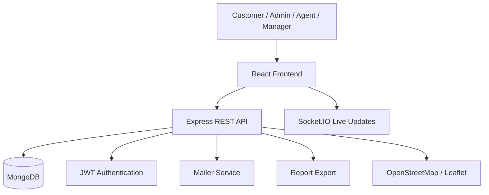
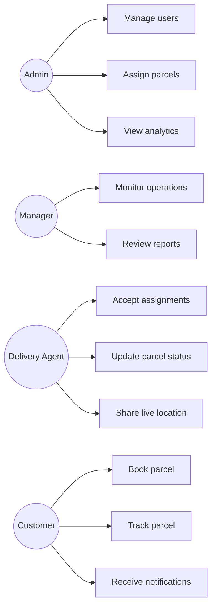
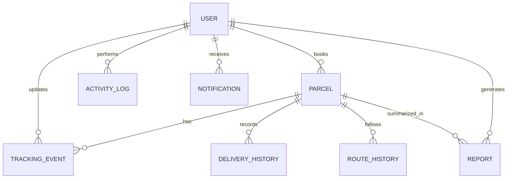
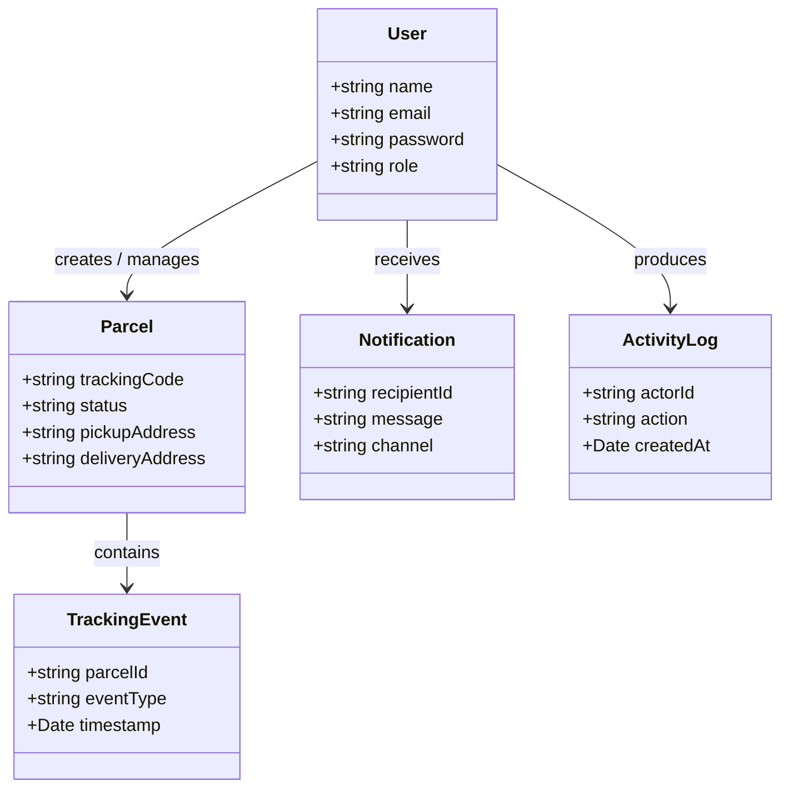
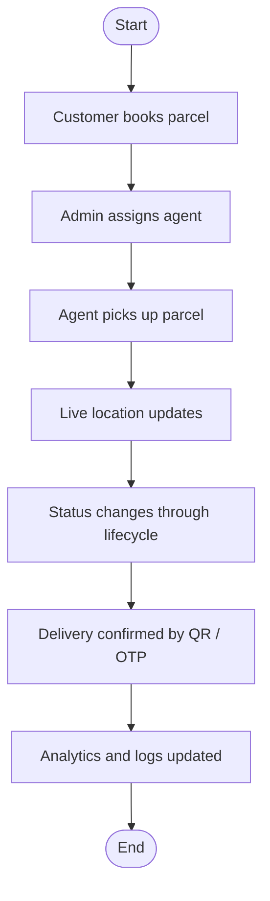
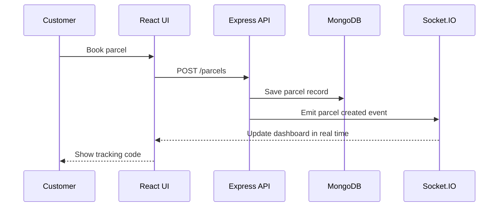
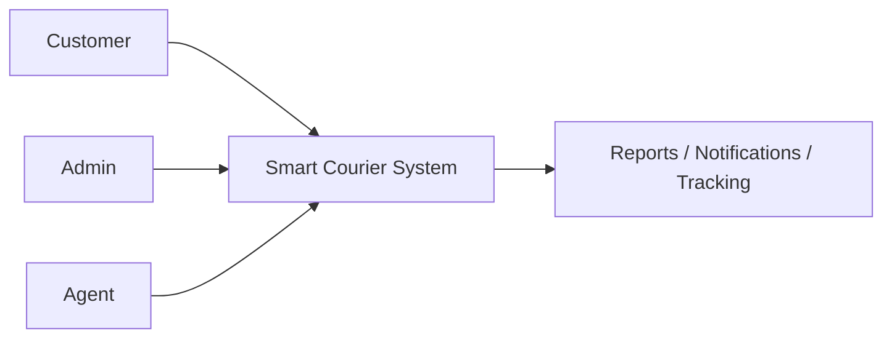
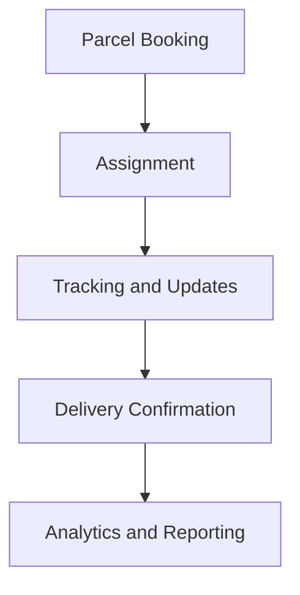
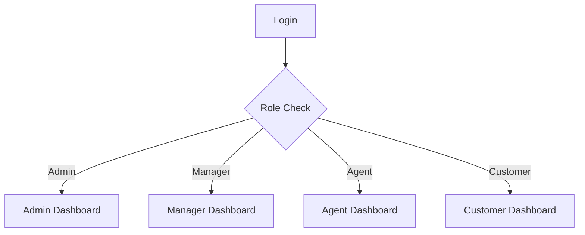

# Design and Implementation of a Smart Courier and Parcel Management System

| Field | Details |
| --- | --- |
| Project Title | Design and Implementation of a Smart Courier and Parcel Management System |
| Project Type | B.Sc. Final Year Thesis Project |
| Research Area | Web Engineering, Software Engineering, Logistics Management |
| Technology Stack | React, Node.js, Express, MongoDB, JWT, Socket.IO, Leaflet, OpenStreetMap |

## Abstract

This project presents the design and implementation of a Smart Courier and Parcel Management System (SCPMS) for managing parcel booking, assignment, tracking, delivery verification, and operational reporting in a modern courier environment. The system was developed as an academic research implementation to address the limitations of manual coordination, fragmented parcel visibility, delayed communication, and weak operational insight commonly observed in courier workflows.

The proposed system introduces role-based access control, live tracking, QR-assisted parcel verification, lifecycle-based parcel monitoring, analytics dashboards, audit logs, and report generation. The implementation demonstrates how a modular MERN architecture can support digital transformation in logistics operations while remaining suitable for thesis evaluation and academic defense.

## 1. Introduction

Courier and parcel management is increasingly dependent on digital systems that can coordinate customers, delivery agents, and administrators in real time. Many existing courier processes still rely on partial digitization, which leads to inconsistent parcel visibility, delayed updates, and limited decision support. SCPMS was designed to address these issues through a web-based platform that centralizes parcel operations and makes status, location, and performance data available to stakeholders according to their roles.

The project is intentionally framed as a research-oriented implementation rather than a commercial product. Its purpose is to demonstrate practical web engineering, applied logistics workflow modeling, and measurable service improvement.

## 2. Problem Statement

Traditional courier operations often face the following problems:

- Parcel information is spread across disconnected tools or manual records.
- Customers cannot easily verify parcel progress in real time.
- Delivery agents receive assignments without strong visibility into operational context.
- Administrators lack consolidated analytics for efficiency assessment.
- Status updates are often delayed or communicated inconsistently.
- Auditability is weak when parcel events are not logged systematically.

These problems reduce transparency, increase coordination cost, and create avoidable delivery delays.

## 3. Objectives

### General Objective

To design and implement a smart courier and parcel management system that improves parcel workflow automation, tracking visibility, and operational analytics.

### Specific Objectives

- Implement secure registration, login, and role-based access control.
- Support parcel booking and assignment across multiple user roles.
- Enable live parcel tracking with map-based visualization.
- Add QR-assisted parcel verification and tracking support.
- Produce operational dashboards for parcels, agents, and delivery outcomes.
- Generate reports for monthly activity, performance, and revenue trends.
- Record activity logs and audit trails for administrative accountability.

## 4. Motivation

The project was motivated by the need to close the gap between courier operations and intelligent web systems. Couriers operate in a dynamic environment where parcel status, location, and delivery performance change continuously. A static system is insufficient for such conditions. SCPMS demonstrates how real-time communication, structured data models, and analytical dashboards can improve operational control while supporting academic research in logistics digitization.

## 5. Existing Problems

Existing courier systems and manual processes commonly exhibit the following limitations:

- Low visibility into parcel lifecycle stages.
- Limited public tracking capability.
- Minimal support for operational analytics.
- Weak evidence trails for failed or delayed delivery events.
- Inefficient communication between agents and administrators.
- Poor support for structured reporting and service evaluation.

## 6. Related Works

Prior web-based logistics systems typically focus on parcel booking and status tracking, but many lack one or more of the following:

- Fine-grained role separation.
- Real-time socket-driven updates.
- Map-aware delivery monitoring.
- Parcel analytics and reporting.
- Delivery audit logs.
- Academic framing with measurable contribution.

SCPMS extends the basic courier workflow by combining these capabilities into a single thesis-ready platform.

## 7. Gap Analysis

| Area | Existing Limitation | Proposed Solution |
| --- | --- | --- |
| Tracking | Manual or delayed status updates | Socket-driven live tracking and lifecycle events |
| Coordination | Fragmented role communication | Role-based dashboards and assignment workflow |
| Visibility | Weak public parcel tracking | Public tracking portal with QR and timeline support |
| Analytics | Limited performance insight | Dashboards, reports, and delivery metrics |
| Accountability | Sparse event records | Audit logs and activity logs |

## 8. Methodology

The project follows a modular software engineering methodology:

1. Requirements analysis from courier workflow observations.
2. System modeling using role and process decomposition.
3. MERN-based implementation with reusable components.
4. Incremental testing of authentication, tracking, and reporting.
5. Validation of real-time updates and dashboard outputs.

The methodology is appropriate for an undergraduate thesis because it connects system design choices with practical logistics outcomes.

## 9. System Architecture

### Architectural Style

- MVC-inspired modular backend.
- Component-based frontend.
- REST API for standard CRUD operations.
- Socket.IO for live parcel and agent updates.
- Map services for route and location visualization.

## 10. Use Case Diagram

## 11. ER Diagram

### Main Collections

- User
- Parcel
- Tracking Event
- Delivery History
- Route History
- Notification
- Activity Log
- Report
- Analytics Snapshot

## 12. Class Diagram

## 13. Activity Diagram

## 14. Sequence Diagram

## 15. DFD

### Level 0

### Level 1

## 16. Flowchart

## 17. Technology Stack

### Frontend

- React
- Vite
- Leaflet
- OpenStreetMap
- Tailwind CSS
- Socket.IO client

### Backend

- Node.js
- Express
- MongoDB
- Mongoose
- JWT
- Socket.IO
- Nodemailer

### Reporting and Utilities

- PDFKit
- CSV export utilities
- QR code generation
- Validation middleware
- REST API tooling

## 18. Implementation

### Authentication and Authorization

Users authenticate through JWT-based sessions. Protected routes enforce access control according to role, which helps separate customer, agent, manager, and admin responsibilities.

### Parcel Lifecycle Management

Parcels move through a structured lifecycle that includes booking, assignment, pickup, transit, delivery, and completion. Each stage is logged to support traceability.

### Live Tracking

The system uses socket-based events and map rendering to expose real-time location updates. This supports operational awareness and public parcel visibility.

### Notifications

Email notifications are triggered for important parcel status changes. The architecture also reserves space for SMS integration in future work.

### Analytics and Reporting

Dashboard metrics summarize delivery success, failure rates, performance ranking, monthly trends, and revenue indicators. Reports can be exported for academic demonstration and management review.

## 19. Testing

Testing was performed at the component and workflow level:

- Authentication and authorization tests.
- Parcel booking and assignment flow tests.
- Live update verification through socket events.
- Map rendering and route interaction checks.
- Notification generation tests.
- Export and analytics screen validation.

## 20. Results

The implemented system demonstrates the following outcomes:

- Improved parcel visibility through real-time updates.
- Better coordination between dispatch and delivery roles.
- Faster retrieval of parcel history and status events.
- Clearer operational insight through analytics dashboards.
- More defensible academic value because the system includes measurable, research-oriented features.

## 21. Future Work

- Delay prediction using machine-learning heuristics.
- Traffic-aware route recommendation.
- Mobile agent companion interface.
- SMS gateway integration.
- OCR-based parcel intake and label recognition.
- Warehouse and hub management extension.

## 22. Conclusion

SCPMS is a thesis-oriented smart courier implementation that addresses transparency, coordination, and analytics gaps in parcel management. By combining MERN architecture, role-based access control, real-time tracking, and reporting, the system demonstrates a practical and academically defensible solution for logistics digitization.

## 23. References

1. Sommerville, I. *Software Engineering*.
2. Pressman, R. *Software Engineering: A Practitioner's Approach*.
3. React documentation.
4. Express documentation.
5. MongoDB and Mongoose documentation.
6. Socket.IO documentation.
7. Leaflet and OpenStreetMap documentation.

## Appendix: Thesis Presentation Alignment

- Objective: Improve courier automation and visibility.
- Existing Problem: Manual coordination and delayed tracking.
- Motivation: Need for digitized logistics workflows.
- Related Works: Existing courier systems with limited analytics.
- Gap Analysis: Missing real-time, role-aware, and academic features.
- Methodology: Modular MERN implementation.
- Expected Outcomes: Better efficiency, traceability, and evaluation evidence.
- Timeline: Requirements, design, implementation, testing, evaluation.
- Conclusion: SCPMS provides a research-ready courier management solution.
- References: Standards, library documentation, and software engineering texts.
