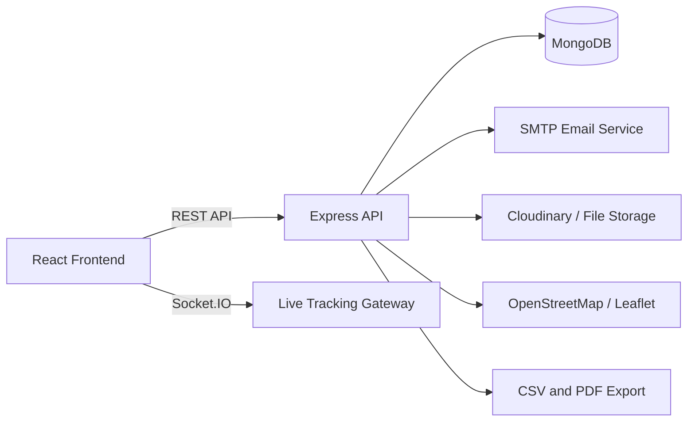

# Design and Implementation of a Smart Courier and Parcel Management System

A B.Sc. thesis implementation focused on secure parcel workflows, live tracking, operational analytics, and role-based delivery coordination.

## Abstract

Smart Courier and Parcel Management System (SCPMS) is a MERN-based web platform designed to improve parcel booking, assignment, tracking, and delivery verification in a logistics environment. The system combines real-time communication, QR-assisted tracking, delivery lifecycle monitoring, and administrative analytics to address inefficiencies commonly found in manual or semi-digital courier operations. The implementation emphasizes digital transformation, operational efficiency, customer visibility, and data-driven decision-making.

## Thesis Focus

- Automation of parcel intake, routing, and assignment.
- Real-time parcel and agent tracking through Socket.IO and map services.
- Role-based access control for admin, manager, agent, and customer workflows.
- Smart notification flow for parcel lifecycle events.
- Delivery performance analytics and monthly reporting.
- Research-oriented evaluation of delivery delay, success rate, and operational throughput.

## Research Contribution

This project contributes an applied web engineering solution for parcel logistics with the following thesis values:

- Reduces manual coordination overhead in parcel handling.
- Improves delivery transparency through public and authenticated tracking.
- Supports operational monitoring with dashboards, logs, and performance summaries.
- Demonstrates a modular MERN architecture that can be extended for future logistics research.
- Introduces lightweight heuristic decision support for estimated delivery time and delay risk.

## Core Features

- QR code parcel tracking.
- Barcode-ready scanning flow.
- Live location tracking for delivery agents.
- Parcel lifecycle timeline.
- Smart estimated delivery time.
- Delay risk heuristic for operational awareness.
- Delivery heatmaps and location history.
- Analytics dashboard for parcel success, failure, and throughput.
- Revenue and monthly operational reports.
- Audit logs and activity logs.
- Email notifications and SMS-ready notification architecture.
- CSV and PDF report export.
- Smart search and advanced filtering.

## Architecture



### Backend Structure

- MVC-inspired modular organization.
- Separate controllers, routes, middleware, services, models, and utilities.
- JWT authentication and authorization middleware.
- Socket-based delivery updates.
- Validation and centralized error handling.

### Frontend Structure

- Dashboard-first layout for academic and operational analysis.
- Shared UI primitives for cards, tables, alerts, and forms.
- Role-aware navigation and protected routes.
- Map-driven delivery views and parcel tracking pages.

## Technology Stack

- React
- Node.js
- Express
- MongoDB
- JWT
- Socket.IO
- Leaflet
- OpenStreetMap
- Cloudinary
- REST API
- CSV export
- PDF reporting

## Repository Structure

- `backend/` - Express API, database models, controllers, and services.
- `frontend/` - React dashboard, tracking pages, and shared UI.
- `PROJECT_REPORT.md` - Thesis-style technical report and academic justification.
- `postman_collection_api.json` - API test collection.

## Getting Started

### Prerequisites

- Node.js 18 or newer
- MongoDB database
- SMTP credentials for email notifications

### Install

```bash
npm install
cd backend && npm install
cd ../frontend && npm install
```

### Run Locally

```bash
# backend
cd backend
npm run dev

# frontend
cd frontend
npm run dev
```

### Environment Setup

Use `backend/env.example` as the reference for required variables. For production, configure:

- `MONGODB_URI`
- `JWT_SECRET`
- `MAIL_HOST`, `MAIL_USER`, `MAIL_PASS`
- `CLIENT_ORIGIN`
- `SOCKET_CORS_ORIGIN`
- `VITE_API_BASE`
- `VITE_SOCKET_URL`

## Validation Goals

The application is designed to support thesis evaluation through:

- Functional testing of authentication, booking, assignment, and tracking.
- Real-time verification of parcel status changes.
- Performance monitoring of analytics and reporting views.
- User workflow validation across admin, manager, customer, and agent roles.

## Future Enhancements

- Machine-learning based delay prediction.
- Route optimization using traffic-aware routing.
- Mobile companion app for delivery agents.
- OCR-assisted parcel intake.
- SMS gateway integration for multi-channel alerts.

## Academic Positioning

SCPMS is presented as an original academic implementation for a final-year thesis in web engineering and logistics management. The project emphasizes system design, measurable operational improvement, and a defensible technical contribution rather than commercial branding.
